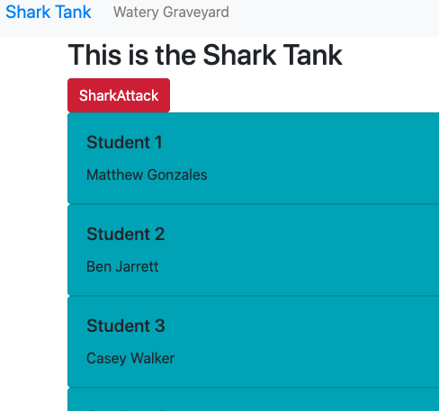
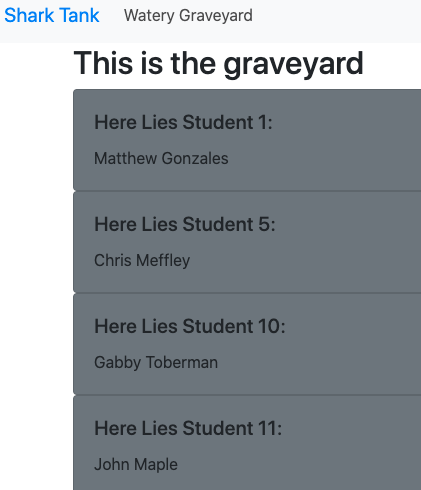

# Shark Attack
Oh no your entire class has fallen into a pool infested with sharks and they are HUNGRY. Click the 'Shark Attack' button to see who randomly gets eaten and gets sent from the shark tank to the graveyard.
### Link to your wireframes/prototype
  [Wireframe](https://www.figma.com/file/xymDnnCBorPVdgV7Q0Gd8g/Shark-Attack?node-id=0%3A1)
### Link to the deployed project
  [Deployed Project](https://mg-shark-attack.netlify.app/)
### Link to your project board
  [Project Board](https://github.com/GonzalesMatthew/shark-tank/projects/1)
### Description of the user
  Click the 'Shark Attack' button to see who randomly gets eaten!
### List of features                                                
  Built with React!
  Two pages! One for the tank with the current survivors, the other containing the names of our dearly beloved.
### Screenshots of your project

### List of contributors and links to their GH profiles
@GonzalesMatthew
### Link to Loom video walkthrough of your app
[App-Walkthrough Video](https://www.loom.com/share/4a38278f851445d0b18636e053bc6fb7)
